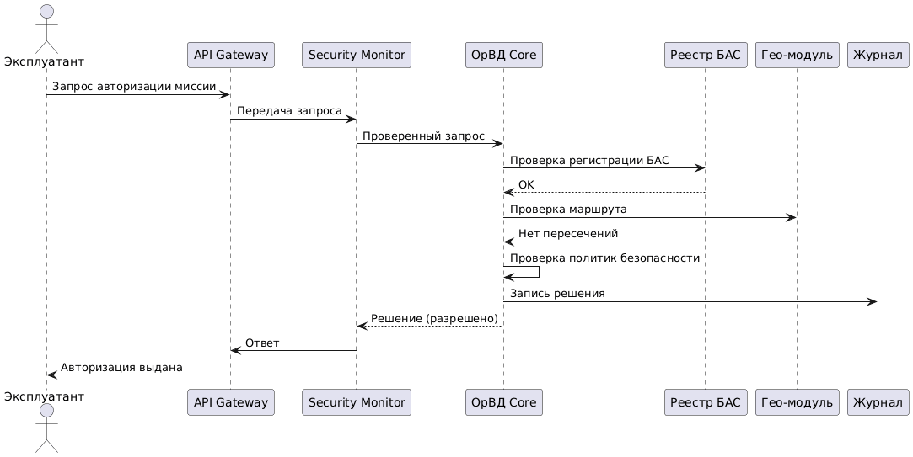
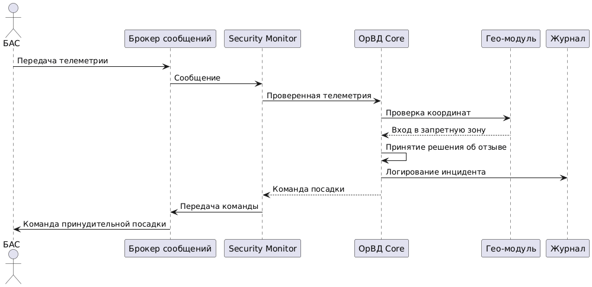
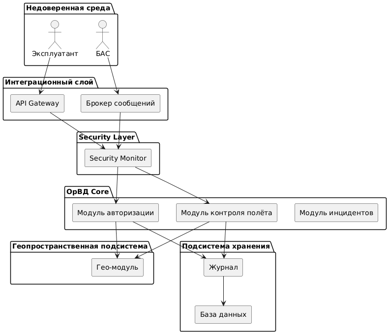
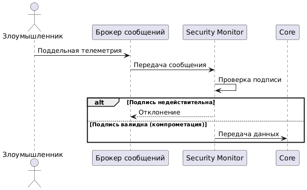
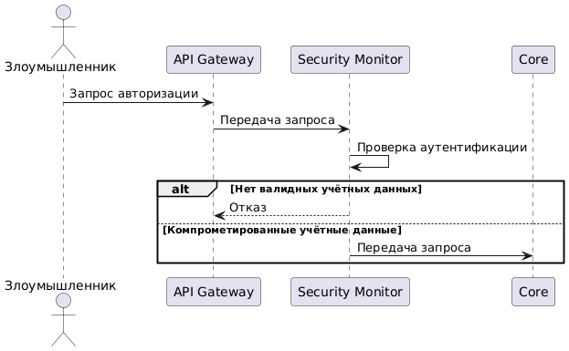

# Анализ безопасности системы ОрВД БАС

---

## Пункт 1. Ключевые активы, оценка уровня ущерба и приемлемость риска

### 1.1. Идентификация активов

Активы системы - это всё, что имеет ценность и что необходимо защищать. Для DroneAnalytics выделяем следующие:


| №   | Актив                                | Описание                                                                                                                                                                        | Категория      |
| --- | ------------------------------------ | ------------------------------------------------------------------------------------------------------------------------------------------------------------------------------- | -------------- |
| A1  | **Решение об авторизации миссии**         | Факт разрешения или запрета выполнения миссии конкретным БАС |  Управляющие Данные         |
| A2  | **Команда принудительной посадки / отзыв разрешения**   | Критическая команда, требующая немедленного прекращения полёта                                     | Управляющие Данные         |
| A3  | **Бесполётные зоны**                     | Географические области, запрещённые для полёта                                                                                                                | Политики / Конфигурация         |
| A4  | **Телеметрия БАС**             | Координаты, статус, параметры полёта, поступающие от БАС                                                  | Данные      |
| A5  | **Журнал событий ОрВД**     | История решений, проверок, нарушений и команд                                                                  | Хранилище / Аудит       |
| A6  | **Политики безопасности ОрВД**               | Формализованные правила авторизации и контроля                                                                               | Логика безопасности        |
| A7  | **Криптографические ключи и сертификаты**    | Ключи подписи сообщений, TLS-сертификаты, подпись регулятора                       | Секреты        |
| A8  | **Регистрационные данные БАС и миссий**            | Идентификаторы БАС, маршруты, параметры миссии                                             | Данные         |
| A9  | **Security Monitor**                 | Компонент, проверяющий междоменное взаимодействие                                                                                                | Сервис безопасности         |
| A10 | **Инфраструктура (брокер, БД, контейнеры)** | Среда выполнения системы                                                                                               | Инфраструктура        |

### 1.2. Оценка уровня ущерба

Оцениваем ущерб по трём классическим свойствам информационной безопасности (CIA: Confidentiality, Integrity, Availability) по шкале:

- **Низкий**
- **Средний**
- **Высокий**
- **Критический**


| Актив                   | Конфиденц.      | Целостность     | Доступность     | Обоснование                                                                                                                                                     |
| ----------------------- | --------------- | --------------- | --------------- | --------------------------------------------------------------------------------------------------------------------------------------------------------------- |
| A1 Авторизация миссии           | Средний         | **Критический** | Высокий         | Подмена решения = незаконный полёт |
| A2 Команда посадки | Средний         | **Критический** | **Критический** | Невозможность остановить БАС — угроза безопасности |
| A3 Бесполётные зоны        | Низкий          | **Критический**         | Высокий         | Подмена зон открывает опасные территории                                                                                                  |
| A4 Телеметрия         | Средний         | Высокий | Высокий         | Подмена координат лишает контроля                                 |
| A5 Журнал      | Средний | **Критический** | Высокий         | Потеря аудита = невозможность расследования                                                                                                         |
| A6 Политики безопасности            | Низкий | **Критический** | Высокий         | Изменение политик = обход защиты                                                                         |
| A7 Ключи и сертификаты           | **Критический**         | **Критический** | Высокий         | ПКомпрометация = полный захват системы                                                                                  |
| A8 Данные миссий           | Средний          | Высокий         | Средний         | Искажение маршрута влияет на безопасность                                                                                 |
| A9 Security Monitor              | Низкий         | **Критический** | **Критический** | Его обход = обход всей модели безопасности                                                                                                            |
| A10 Инфраструктура        | Средний |Высокий |  **Критический**        | Отказ = остановка системы                                                                                     |                                     


### 1.3. Приемлемость риска


| Актив                   | Приемлемость риска                           | Пояснение                                                                                     |
| ----------------------- | -------------------------------------------- | --------------------------------------------------------------------------------------------- |
| A1 Авторизация         | **Неприемлем**             | Ошибка ведёт к незаконному вылету |
| A2 Посадка | **Неприемлем** | Потеря контроля над БАС |
| A3 Зоны         | **Неприемлем**                             | Нарушение воздушного пространства                                              |
| A4 Телеметрия         | **Неприемлем** для целостности               | Подмена искажает контроль                               |
| A5 Журнал       | **Неприемлем**                               | Основа аудита                                                                |
| A6 Политики            | **Неприемлем**                               |Обход безопасности                                                       |
| A7 Ключи           | **Неприемлем**                               | Компрометация = полный захват                                    |
| A8 Миссии           | Частично приемлем                              | Ошибка ограничена одной миссией                                    |

**Вывод по п. 1:** Наиболее критичными активами являются:

1. Решения об авторизации миссий

2. Команды принудительной посадки 

3. Бесполётные зоны 

4. Журнал событий 

5. Политики безопасности, Криптографические ключи, Security Monitor

---

## Пункт 2. Роли пользователей и ключевые сценарии использования

### 2.1. Роли пользователей

| Роль                              | Описание                                                  | Уровень доверия             |
| --------------------------------- | --------------------------------------------------------- | --------------------------- |
| **Эксплуатант БАС**               | Подаёт миссии, получает решения об авторизации            | Низкий                      |
| **БАС (бортовой модуль)**         | Исполняет миссию, передаёт телеметрию                     | Низкий / Условно доверенный |
| **Оператор ОрВД**                 | Контролирует систему, может инициировать отзыв разрешения | Высокий                     |
| **Регулятор**                     | Обновляет политики и бесполётные зоны                     | Высокий                     |
| **Система ОрВД**                  | Принимает решения                                         | Доверенный домен            |
| **Security Monitor**              | Контроль междоменных взаимодействий                       | Максимально доверенный      |
| **Внешние сервисы (реестр, гео)** | Предоставляют справочные данные                           | Средний                     |


### 2.2. Сценарий 1: Авторизация миссии

**Контекст:** Эксплуатант подаёт миссию.
Система должна проверить:
- регистрацию БАС
- действительность лицензии
- соответствие маршрута бесполётным зонам
- актуальные политики безопасности
Только после этого выдать решение.




### 2.3. Сценарий 2: Нарушение и принудительная посадка

**Контекст:** БАС выполняет миссию.
Система обнаруживает:
- отклонение от маршрута
- вход в запрещённую зону
- отзыв разрешения
Необходимо инициировать посадку.



---

## Пункт 3. Функциональная архитектура системы

### 3.1. Общая схема

Система ОрВД БАС предназначена для:
- авторизации миссий беспилотных воздушных судов (БАС),
- контроля выполнения миссий,
- выявления нарушений воздушного пространства,
- формирования управляющих воздействий (отзыв разрешения, принудительная посадка),
- ведения аудита решений.

Архитектура построена по принципам:
- централизованного принятия решений,
- обязательного контроля межкомпонентного взаимодействия,
- изоляции доверенных доменов,
- журналирования всех критичных операций.


### 3.2. Функциональные модули и их назначение


| Компонент                         | Функция                                                           | Входные данные               | Выходные данные                   | Уровень доверия |
| --------------------------------- | ----------------------------------------------------------------- | ---------------------------- | --------------------------------- | --------------- |
| **API Gateway**                   | Приём REST-запросов от эксплуатантов и операторов                 | HTTP(S) запросы              | JSON-запросы во внутренний контур | Низкий          |
| **Брокер сообщений**              | Приём телеметрии и передача управляющих команд                    | Сообщения от БАС             | Сообщения во внутренний контур    | Низкий          |
| **Security Monitor**              | Проверка подлинности, контроль политик, фильтрация вызовов        | Запросы, телеметрия          | Разрешённые вызовы в Core         | Максимальный    |
| **Модуль авторизации миссий**     | Принятие решения о разрешении/запрете миссии                      | Параметры миссии             | Решение об авторизации            | Высокий         |
| **Модуль контроля полёта**        | Анализ телеметрии и выявление нарушений                           | Координаты, статус БАС       | Команда посадки / уведомление     | Высокий         |
| **Модуль управления инцидентами** | Обработка событий безопасности                                    | Сигналы о нарушении          | Управляющее воздействие           | Высокий         |
| **Геопространственный модуль**    | Проверка маршрутов и координат на пересечение с запретными зонами | Координаты, маршрут          | OK / Нарушение                    | Средний         |
| **Журнал (Audit Log)**            | Фиксация решений и событий                                        | События системы              | Запись в БД                       | Высокий         |
| **База данных**                   | Хранение миссий, решений, политик и журналов                      | SQL-запросы                  | Данные                            | Высокий         |
| **Модуль администрирования**      | Управление политиками и зонами                                    | Команды оператора/регулятора | Обновлённые политики              | Высокий         |


### 3.3. Потоки данных

**Поток 1: Авторизация миссии**

```
Эксплуатант → API Gateway → Security Monitor → 
Модуль авторизации → Гео-модуль → Журнал → Ответ пользователю
```

**Поток 2: Контроль выполнения миссии**

```
БАС → Брокер сообщений → Security Monitor → 
Модуль контроля полёта → Гео-модуль → 
(при нарушении) → Модуль инцидентов → Команда посадки → БАС
```
### 3.4. Логическая схема архитектуры



### 3.5. Границы доверия

| Домен               | Уровень доверия | Обоснование                       |
| ------------------- | --------------- | --------------------------------- |
| Внешняя среда       | Недоверенный    | Контролируется третьими сторонами |
| Интеграционный слой | Низкий          | Подвержен сетевым атакам          |
| Security Layer      | Максимальный    | Контроль доступа и политик        |
| Core                | Высокий         | Принятие критичных решений        |
| Гео-модуль          | Средний         | Использует справочные данные      |
| Хранилище           | Высокий         | Требуется целостность             |

---

## Пункт 4. Цели и предположения безопасности

### 4.1. Основание для формулирования целей

Цели безопасности сформулированы на основе:

- анализа ключевых активов;
- функциональной архитектуры системы;
- критичности решений об управлении полётами БАС.

Наиболее критичными активами являются:

- решение об авторизации миссии;
- команда принудительной посадки;
- бесполётные зоны;
- журнал событий;
- политики безопасности;
- криптографические ключи.

Цели безопасности направлены на защиту целостности, подлинности и доступности этих активов.

### 4.2 Цели безопасности системы

**Цель 1 - Предотвращение несанкционированного вылета**
Система должна обеспечивать, чтобы выполнение миссии БАС было возможно только после прохождения процедуры авторизации в доверенном домене Core.

Требования:

- обязательная аутентификация эксплуатанта;

- проверка регистрации БАС;

- проверка маршрута;

- фиксация решения в журнале.

Защищаемый актив: решение об авторизации миссии.

**Цель 2 - Контроль выполнения миссии**
Система должна обеспечивать невозможность несанкционированного изменения данных о запретных зонах.

Требования:

- изменение зон только через модуль администрирования;

- разграничение прав доступа;

- аудит изменений.

Защищаемый актив: бесполётные зоны.

**Цель 3 - Защита управляющих команд**
Система должна обеспечивать, чтобы команда принудительной посадки:

- формировалась только в доверенном домене Core;

- не могла быть подделана внешним субъектом;

- доставлялась только аутентифицированному БАС.

Защищаемый актив: команда принудительной посадки.

**Цель 4 - Контроль выполнения миссии**
Система должна обеспечивать выявление отклонения от маршрута и входа в запрещённую зону в режиме, близком к реальному времени.

Требования:

- проверка телеметрии;

- геопространственный анализ;

- автоматическая генерация инцидента.

Защищаемые активы:

- телеметрия БАС;

- команда принудительной посадки.

**Цель 5 - Обеспечение неизменности журнала**
Система должна обеспечивать:

- запись всех критичных решений;

- невозможность несанкционированного удаления или изменения записей;

- возможность последующего аудита.

Защищаемый актив: журнал событий.

**Цель 6 - Контроль междоменных взаимодействий**
Система должна обеспечивать, чтобы:

- ни один вызов к Core не выполнялся в обход Security Monitor;

- все входящие сообщения проходили проверку подлинности и целостности;

- применялись актуальные политики безопасности.

Защищаемый актив:

- политики безопасности;

- логика принятия решений.

## 4.3 Предположения безопасности

Предположения фиксируют границы модели угроз.

**A1. Доверенность аппаратной платформы сервера**
Предполагается, что серверная инфраструктура не скомпрометирована на уровне аппаратуры

**A2. Доверенность регулятора**
Предполагается, что субъект, обновляющий политики и зоны, действует добросовестно и обладает легитимными полномочиями.

**A3. Исполнение команд БАС**
Предполагается, что БАС исполняет полученные легитимные команды (в частности, команду посадки).

**A4. Защищённость каналов связи**
Предполагается использование защищённых каналов передачи данных (TLS / подписанные сообщения).


---

## Пункт 5. Моделирование угроз

### 5.1. Угроза 1: Подмена телеметрии БАС

**Описание:** Злоумышленник отправляет поддельную телеметрию от имени легитимного БАС с целью: скрыть вход в запрещённую зону, имитировать ложное местоположение, избежать принудительной посадки.

**Нарушаемые цели:** Контроль выполнения миссии, защита управляющих команд, контроль междоменных взаимодействий


**Оценка критичности:** КРИТИЧЕСКАЯ. Подмена координат может привести к нарушению воздушного пространства и сокрытию инцидента.

**Контрмеры:**

- Обязательная цифровая подпись телеметрии
- Привязка сертификата к конкретному БАС
- Проверка аномалий (невозможные скорости/скачки координат)
- Логирование всех отклонённых сообщений

---

### 5.2. Угроза 2: Несанкционированная авторизация миссии

**Описание:** Злоумышленник подаёт миссию: от имени другого эксплуатанта, с подменёнными параметрами, с целью незаконного вылета.

**Нарушаемые цели:** Предотвращение несанкционированного вылета, контроль междоменных взаимодействий, корректность журнала


**Оценка критичности:** КРИТИЧЕСКАЯ. Незаконный вылет напрямую угрожает безопасности воздушного пространства.

**Контрмеры:**

- Многофакторная аутентификация эксплуатантов
- Проверка привязки БАС к владельцу
- Контроль аномальной активности
- Аудит попыток входа

---

### 5.3. Угроза 3: Модификация бесполётных зон

**Описание:** Злоумышленник получает доступ к данным зон и изменяет границы запретной области.

**Нарушаемые цели:** защита целостности зон, контроль выполнения миссии

**Оценка критичности:** КРИТИЧЕСКАЯ. Изменение зон открывает возможность полёта в запрещённом пространстве.

**Контрмеры:**

- Разграничение прав доступа
- Подписание конфигураций зон
- Версионирование изменений
- Жёсткий аудит действий администратора

---

### 5.4. Угроза 4: DoS-атака на интеграционный слой

**Описание:** Массовая отправка запросов или телеметрии с целью перегрузки системы.

**Нарушаемые цели:** контроль выполнения миссии, доставка команды посадки, журналирование

**Оценка критичности:**ВЫСОКАЯ. Недоступность системы во время инцидента критична.

**Контрмеры:**

- Rate limiting на API Gateway
- Ограничение частоты телеметрии
- Очереди сообщений
- Горизонтальное масштабирование

---


**Вывод по п. 5:** Наиболее критичными функциями системы ОрВД БАС являются:

- авторизация миссий,

- приём и анализ телеметрии,

- формирование команды принудительной посадки,

- контроль целостности бесполётных зон.

---

## Пункт 6. Диаграмма архитектуры политики информационной безопасности

### 6.1. Уровни доверия

| Уровень | Домен               | Характеристика                                |
| ------- | ------------------- | --------------------------------------------- |
| L0      | Внешняя среда       | Полностью недоверенная                        |
| L1      | Интеграционный слой | Частично доверенный, подвержен сетевым атакам |
| L2      | Гео-модуль          | Использует внешние данные, требует валидации  |
| L3      | ОрВД Core           | Доверенный домен принятия решений             |
| L4      | Security Layer      | Максимально доверенный домен контроля         |


### 6.2. Принципы архитектуры политики
**Все критичные вызовы через монитор**
Ни один запрос к Core не может выполняться напрямую

**Политика минимальных привилегий**
Каждый компонент имеет только необходимый доступ, БД недоступна напрямую из L0,L1

**Политика обязательного журналирования**
Все критичные действия фиксируются


### 6.3. Диаграмма архитектуры политики


### 6.4 Отображение политик на уровнях

| Политика                     | Уровень применения |
| ---------------------------- | ------------------ |
| Аутентификация эксплуатантов | L1 → L4            |
| Проверка цифровых подписей   | L4                 |
| Контроль вызовов Core        | L4                 |
| Проверка маршрутов           | L3 + L2            |
| Формирование команд посадки  | L3                 |
| Журналирование               | L3                 |
| Хранение данных              | L3                 |
| Изоляция БД                  | L3                 |


Связь с угрозами:

| Угроза                 | Защитный уровень |
| ---------------------- | ---------------- |
| Подмена телеметрии     | L4               |
| Незаконная авторизация | L4 + L3          |
| Обход Monitor          | L4               |
| Изменение зон          | L3               |
| DoS                    | L1               |

---